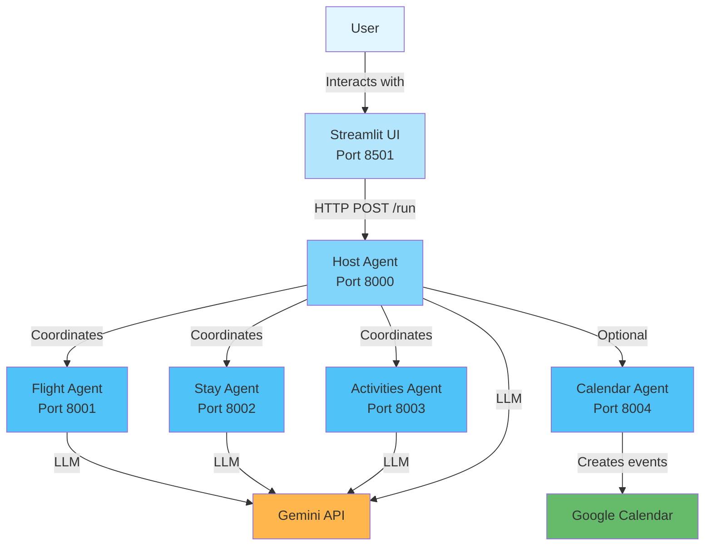

# Complete Setup Guide for ADK-Powered Travel Planner

## Overview

This guide will help you set up and run the ADK-Powered Travel Planner for the **Kaggle Agents Intensive Capstone Project**. This multi-agent AI system demonstrates how intelligent agents coordinate to plan complete trips using Google's Agent Development Kit (ADK).

## Prerequisites

- **Python 3.8+** installed on your system
- **PowerShell** (Windows) or Bash (Linux/Mac)
- **Gemini API Key** from [Google AI Studio](https://aistudio.google.com/app/apikey)
- **Git** (optional, for cloning)

## Installation Steps

### 1. Clone or Download the Repository

```powershell
git clone https://github.com/NikitSharma/Google-Agent-Development-Kit-Demo.git
cd Google-Agent-Development-Kit-Demo
```

### 2. Create a Virtual Environment

Creating a virtual environment is **strongly recommended** to avoid dependency conflicts.

```powershell
# Create virtual environment
python -m venv venv

# Activate it
.\venv\Scripts\Activate.ps1  # Windows PowerShell
# OR
source venv/bin/activate      # Linux/Mac
```

### 3. Install Dependencies

```powershell
pip install -r requirements.txt
```

This will install:
- `google-adk` - Google's Agent Development Kit
- `litellm` - Model integration layer
- `fastapi` & `uvicorn` - Web framework for agents
- `streamlit` - UI framework
- `httpx` - HTTP client
- `pydantic` - Data validation
- Google Calendar API libraries (optional)

### 4. Configure Environment Variables

> [!IMPORTANT]
> You **must** have a valid Gemini API key to run this project.

#### Option A: Use the start_all.ps1 Script (Recommended)

The `start_all.ps1` script will prompt you for the API key if it's not set. Simply run:

```powershell
.\start_all.ps1
```

#### Option B: Set Environment Variable Manually

**Windows PowerShell:**
```powershell
$env:GEMINI_API_KEY = "your-api-key-here"
```

**Linux/Mac Bash:**
```bash
export GEMINI_API_KEY="your-api-key-here"
```

#### Option C: Create a .env File (Advanced)

> [!WARNING]
> The `.env` file is gitignored for security. Never commit API keys to version control.

If you want to persist your API key, you can create a `.env` file manually by copying from `.env.example`:

```powershell
# Copy the example file
copy .env.example .env

# Edit .env and replace with your actual API key
notepad .env
```

Then update the `GEMINI_API_KEY` value with your actual key.

## Running the Project

### Quick Start (All Services at Once)

The easiest way to start everything is using the provided PowerShell script:

```powershell
.\start_all.ps1
```

This script will:
1. Check for your Gemini API key
2. Start all 5 agent services in separate windows
3. Launch the Streamlit UI in your browser

### Manual Start (Individual Services)

If you prefer to start services individually, open **5 separate terminals** and run:

**Terminal 1 - Host Agent:**
```powershell
uvicorn agents.host_agent.__main__:app --port 8000
```

**Terminal 2 - Flight Agent:**
```powershell
uvicorn agents.flight_agent.__main__:app --port 8001
```

**Terminal 3 - Stay Agent:**
```powershell
uvicorn agents.stay_agent.__main__:app --port 8002
```

**Terminal 4 - Activities Agent:**
```powershell
uvicorn agents.activities_agent.__main__:app --port 8003
```

**Terminal 5 - Calendar Agent:**
```powershell
uvicorn agents.calendar_agent.__main__:app --port 8004
```

**Terminal 6 - Streamlit UI:**
```powershell
streamlit run travel_ui.py
```

## Using the Application

1. **Open your browser** to http://localhost:8501 (should open automatically)
2. **Fill in the travel details:**
   - Origin city (e.g., "New York")
   - Destination (e.g., "Paris")
   - Start date and end date
   - Budget in INR (e.g., 150000)
3. **Optional:** Check "Add to Google Calendar" if you've set up calendar integration
4. **Click "Plan My Trip ✨"**
5. **Review the results:**
   - Flight suggestions with airlines, times, and prices
   - Hotel recommendations with amenities
   - Activity suggestions with descriptions

## Verifying the Setup

### Test Package Imports

Ensure all packages are properly configured:

```powershell
python -c "import agents; import agents.host_agent; import agents.flight_agent; import agents.stay_agent; import agents.activities_agent; import agents.calendar_agent; import shared; import common; print('✅ All packages imported successfully')"
```

### Check Service Health

Once services are running, verify each endpoint in your browser:

- Host Agent: http://localhost:8000/docs
- Flight Agent: http://localhost:8001/docs
- Stay Agent: http://localhost:8002/docs
- Activities Agent: http://localhost:8003/docs
- Calendar Agent: http://localhost:8004/docs

Each should display FastAPI's interactive API documentation.

## Google Calendar Integration (Optional)

To enable automatic calendar event creation:

### 1. Create Google Cloud Project

1. Go to [Google Cloud Console](https://console.cloud.google.com/)
2. Create a new project or select existing one

### 2. Enable Google Calendar API

1. Navigate to "APIs & Services" → "Library"
2. Search for "Google Calendar API"
3. Click "Enable"

### 3. Create OAuth 2.0 Credentials

1. Go to "APIs & Services" → "Credentials"
2. Click "Create Credentials" → "OAuth client ID"
3. Choose "Desktop app" as application type
4. Download the credentials JSON file
5. Rename to `credentials.json` and place in project root

### 4. First-Time Authentication

When you first use the calendar feature:
- Your browser will open for OAuth authentication
- Sign in and grant calendar access
- A `token.pickle` file will be created for future use

## Troubleshooting

### Common Issues and Solutions

#### ❌ "GEMINI_API_KEY not found"

**Solution:** Set the environment variable using one of the methods in Step 4 above.

#### ❌ "ModuleNotFoundError: No module named 'google.adk'"

**Solution:** Ensure you've activated your virtual environment and installed dependencies:
```powershell
.\venv\Scripts\Activate.ps1
pip install -r requirements.txt
```

#### ❌ "Address already in use" (Port conflict)

**Solution:** Another process is using the port. Find and stop it:
```powershell
# Find process using port 8000 (change number as needed)
netstat -ano | findstr :8000

# Stop the process (replace PID with actual process ID)
taskkill /PID <PID> /F
```

#### ❌ "Connection refused" / Agents can't communicate

**Solution:** Ensure all 5 agent services are running before using the UI. Use `start_all.ps1` to ensure proper startup.

#### ❌ Streamlit UI shows "Failed to fetch travel plan"

**Solution:** 
1. Check that all agent services are running and healthy
2. Verify your Gemini API key is valid
3. Check the terminal logs for error messages

#### ❌ Calendar integration fails

**Solution:**
1. Ensure `credentials.json` is in the project root
2. Delete `token.pickle` and re-authenticate
3. Check that Calendar Agent is running on port 8004

### Stopping All Services

**If using start_all.ps1:**
1. Close the Streamlit browser tab
2. Press `Ctrl+C` in the main terminal
3. Close all PowerShell windows that were opened

**If manually started:**
- Press `Ctrl+C` in each terminal window

## Architecture Overview



## Project Structure

```
Google-Agent-Development-Kit-Demo/
├── agents/                  # All agent implementations
│   ├── host_agent/         # Coordinates other agents
│   ├── flight_agent/       # Flight suggestions
│   ├── stay_agent/         # Hotel recommendations
│   ├── activities_agent/   # Activity suggestions
│   └── calendar_agent/     # Google Calendar integration
├── common/                  # A2A protocol client/server
├── shared/                  # Shared Pydantic models
├── travel_ui.py            # Streamlit frontend
├── start_all.ps1           # Startup script (Windows)
├── requirements.txt        # Python dependencies
└── README.md               # Project overview
```

## Need Help?

- **Kaggle Competition:** [Agents Intensive - Capstone Project](https://www.kaggle.com/competitions/agents-intensive-capstone-project)
- **Google ADK Docs:** [Agent Development Kit Documentation](https://github.com/google/agent-development-kit)
- **Gemini API:** [Get API Key](https://aistudio.google.com/app/apikey)

## Next Steps

1. ✅ Complete setup following this guide
2. ✅ Test the application with a sample trip
3. ✅ Explore the code to understand agent orchestration
4. 🚀 Customize agents for your Kaggle submission
5. 🚀 Add new features or agents to enhance functionality
6. 🚀 Document your improvements and submit to Kaggle
